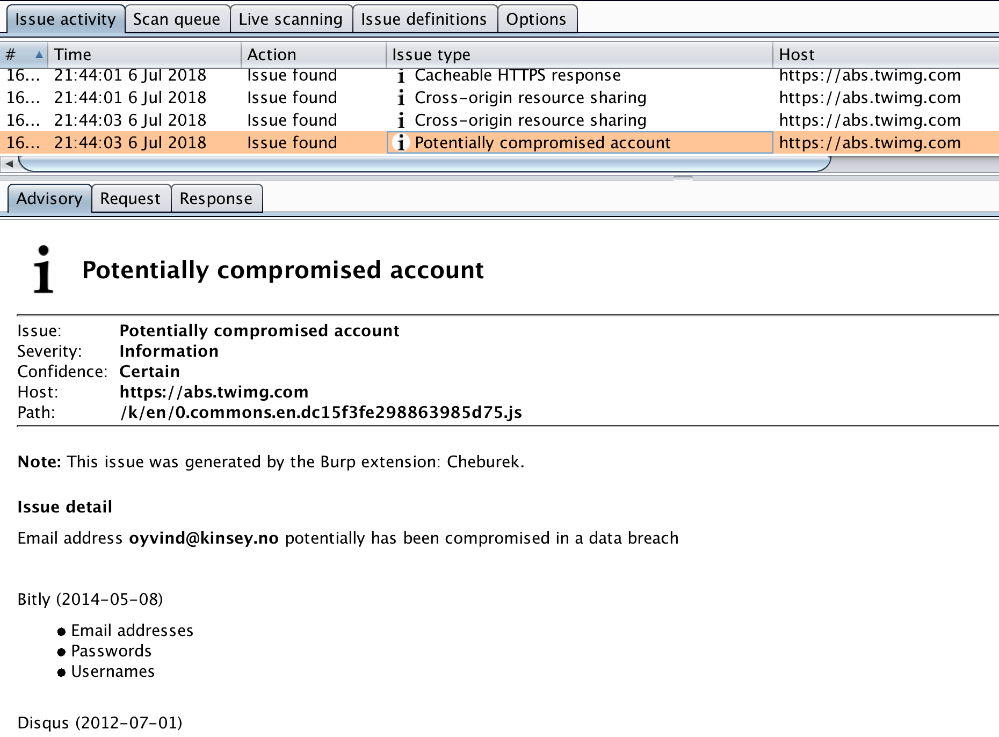
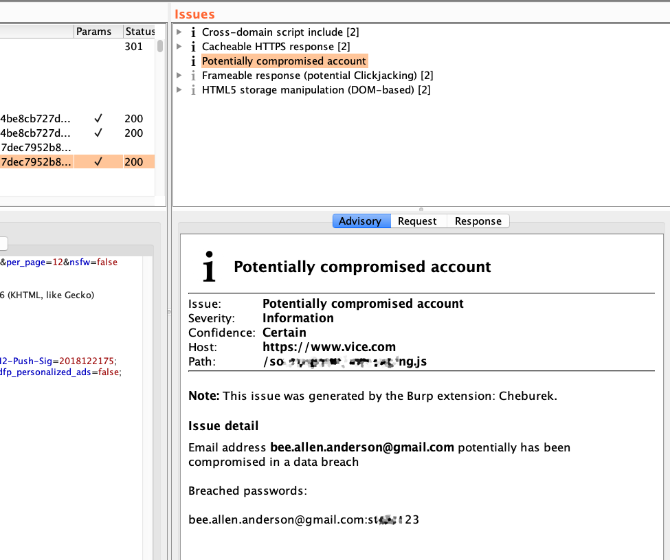

## Cheburek

 

### What is this?

*Cheburek* is [Burp](https://portswigger.net/) extension that allows to detect if email address has been compromised in a data breach.

 

Here is an example when *Cheburek* has found breached account in my local DB with breaches.

 

### How does it work?

Easy Peasy!

Extension uses [https://haveibeenpwned.com/](https://haveibeenpwned.com/) API for checking if email address is in different data breacheas.\
Also *Cheburek* allows you to use your own breach db (Collection\#1 for example)

### Requirements

* Burp Suite Professional (version 1.6 or later)
* Standalone [Jython 2.5](http://www.jython.org/downloads.html) or later 

### Release Notes

#### Version 0.0.1 (06 July, 2018):
 * Initial Public Release

#### Version 0.0.2 (19 February, 2019):
 * Add search in local breach db 

### TODO

- [ ] Improve the regular expression for extracting email
- [x] Add search in local breach db
- [ ] Multithreading!

